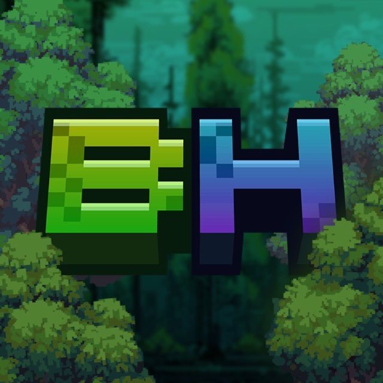

# Вики сервера Bonsai House

Добро пожаловать в вики нашего ванилла++ сервера! Здесь собрана вся информация о механиках, крафтах и особенностях игры.

## Основные разделы

* [Генерация мира](docs/world-generation/overworld.md)
* [Передвижение](docs/movement/mount-summoning.md)
* [Крафты и рецепты](docs/crafting/improved-stonecutter.md)
* [Зачарования и эффекты брони](docs/enchantments/enchantment-levels.md)
* [Ресурспаки](docs/resource-packs/weapon-skins.md)

## Быстрый старт

1. Ознакомьтесь с [правилами сервера](docs/rules/general-rules.md).
2. Изучите механику [призыва маунта](docs/movement/mount-summoning.md).
3. Попробуйте создать [канат и зиплайн](docs/movement/ropes-ziplines.md).

